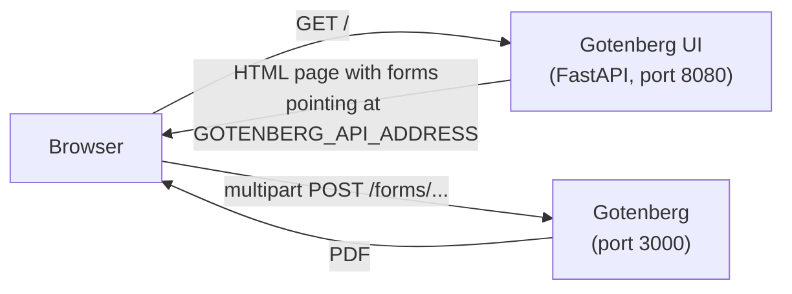

*Please :star: this repo if you find it useful*

<p align="left"><br>
<a href="https://www.paypal.com/paypalme/techblogil?locale.x=he_IL" target="_blank"></a>
</p>

# Gotenberg UI

[](https://hub.docker.com/r/techblog/gotenbergui)
[](https://hub.docker.com/r/techblog/gotenbergui)
[](License)

Gotenberg UI (branded **PDF Utils** in the page title) is a [FastAPI](https://fastapi.tiangolo.com/) based web application that lets you convert web pages (URLs), HTML files and office documents to PDF, and merge multiple PDF files into a single PDF.

It is a UI wrapper for [Gotenberg](https://gotenberg.dev/), a "Docker-powered stateless API for PDF files" written in Go. Gotenberg UI does not convert anything itself: it serves a simple web page whose forms post your input straight to your own Gotenberg server.

## Table of Contents

- [Features](#features)
- [How it works](#how-it-works)
- [Requirements](#requirements)
- [Installation](#installation)
- [Configuration](#configuration)
- [Usage](#usage)
- [HTTP routes](#http-routes)
- [Security notes](#security-notes)
- [Troubleshooting](#troubleshooting)
- [Development](#development)
- [Contributing](#contributing)
- [Credits](#credits)
- [License](#license)

## Features

Four tabs, each backed by a Gotenberg route:

| Tab | What it does | Gotenberg route |
|-----|--------------|-----------------|
| Convert Web Page | Converts a URL to PDF with Chromium | `POST /forms/chromium/convert/url` |
| Convert HTML file | Converts an uploaded `index.html` (plus optional images, fonts, stylesheets, …) to PDF with Chromium | `POST /forms/chromium/convert/html` |
| Convert Documents | Converts one or more office documents (`.docx`, `.xlsx`, `.pptx`, `.odt`, `.rtf`, `.txt`, `.csv`, images and many more) to PDF with LibreOffice | `POST /forms/libreoffice/convert` |
| Merge PDF Documents | Merges several PDF files into one PDF | `POST /forms/pdfengines/merge` |

- Shows the number, names and sizes of the selected files before upload.
- Warns you when the HTML tab's selection does not include an `index.html` file.
- Multi-arch Docker image: `linux/amd64`, `linux/arm64`, `linux/arm/v7`.

### Convert URL to PDF file
[](https://github.com/t0mer/gotenberg-ui/blob/main/screenshots/gotenberg%20-%20convert%20web%20page.png?raw=true "Convert URL")

### Convert HTML file to PDF file
[](https://github.com/t0mer/gotenberg-ui/blob/main/screenshots/gotenberg%20-%20convert%20html%20file.png?raw=true "Convert HTML file")

### Convert documents to PDF file
[](https://github.com/t0mer/gotenberg-ui/blob/main/screenshots/gotenberg%20-%20convert%20documents.png?raw=true "Convert Documents")

### Merge multiple PDF documents into a single file
[](https://github.com/t0mer/gotenberg-ui/blob/main/screenshots/gotenberg%20-%20merge%20pdf%20files.png?raw=true "Merge Documents")

## How it works



1. The FastAPI app serves a single page (`/`) and its static assets. It renders the value of `GOTENBERG_API_ADDRESS` into the `action` attribute of each form.
2. When you press **Convert** or **Merge**, **your browser** submits the form directly to Gotenberg. The UI container never sees your files or URLs.
3. Gotenberg returns the resulting PDF to the browser.

Because of step 2, `GOTENBERG_API_ADDRESS` must be an address **your browser** can reach (for example `http://192.168.1.10:3000`), not a Docker-internal hostname such as `http://gotenberg:3000`.

## Requirements

- Docker (or Python 3 to run from source, see [Development](#development)).
- A running [Gotenberg](https://gotenberg.dev/) server reachable from the browser. The routes the UI calls exist in **Gotenberg 7 and 8** (checked against Gotenberg 8.37.0). They do **not** exist in Gotenberg 6 and older, which used different routes (`/convert/url`, `/convert/office`, `/merge`, …).

## Installation

### Docker image

The image is published on Docker Hub as [`techblog/gotenbergui`](https://hub.docker.com/r/techblog/gotenbergui) for `linux/amd64`, `linux/arm64` and `linux/arm/v7`.

> The newest published tag is `2.0.1` (also `latest`, May 2023). The `VERSION` file says `2.1.1`, but that version has not been pushed. The application code has not changed since 2.0.1.

### Docker Compose (Gotenberg + Gotenberg UI)

```yaml
services:
  gotenberg:
    image: gotenberg/gotenberg:8
    container_name: gotenberg
    restart: always
    ports:
      - "3000:3000"

  gotenbergui:
    image: techblog/gotenbergui:latest
    container_name: gotenbergui
    restart: always
    environment:
      # Must be reachable from the browser, e.g. http://<docker-host-ip>:3000 (no trailing slash)
      - GOTENBERG_API_ADDRESS=http://<docker-host-ip>:3000
    ports:
      - "8080:8080"
    depends_on:
      - gotenberg
```

`gotenberg/gotenberg` is the official Gotenberg image; `thecodingmachine/gotenberg` is its older name; that mirror stopped at 8.30.1, so use `gotenberg/gotenberg`.

Then open `http://<docker-host-ip>:8080`.

### Docker run

```bash
docker run -d --name gotenberg -p 3000:3000 gotenberg/gotenberg:8

docker run -d --name gotenbergui -p 8080:8080 \
  -e GOTENBERG_API_ADDRESS=http://<docker-host-ip>:3000 \
  techblog/gotenbergui:latest
```

## Configuration

| Environment variable | Default | Description |
|----------------------|---------|-------------|
| `GOTENBERG_API_ADDRESS` | empty in the Docker image; unset when running from source | Base URL of the Gotenberg server, **as seen from the browser**, without a trailing slash, e.g. `http://192.168.1.10:3000`. The UI appends `/forms/...` to it. |

There are no other settings. The listening port is fixed at **8080** (`0.0.0.0:8080`); map it to another host port with Docker if needed.

## Usage

1. Open the UI in your browser.
2. Pick a tab:
   - **Convert Web Page**: enter a full URL (e.g. `https://example.com`) and press **Convert**.
   - **Convert HTML file**: select `index.html` plus any assets it uses. Asset paths in `index.html` must be at the root level (e.g. ``).
   - **Convert Documents**: select one or more documents. The supported extensions are listed on the page.
   - **Merge PDF Documents**: select the PDF files to merge.
3. The browser receives the PDF from Gotenberg.

## HTTP routes

Routes served by Gotenberg UI itself:

| Method | Path | Purpose |
|--------|------|---------|
| `GET` | `/` | The web UI |
| `GET` | `/dist/*`, `/js/*`, `/css/*`, `/images/*` | Static assets |
| `GET` | `/docs`, `/redoc`, `/openapi.json` | FastAPI's automatic API docs (they only list `/`) |

All PDF work is done by Gotenberg's own API; see the [Gotenberg routes documentation](https://gotenberg.dev/docs/getting-started/routes) if you want to call it directly.

## Security notes

- **No authentication.** Neither the UI nor a default Gotenberg install requires a login. Don't expose them to the internet without a reverse proxy that adds authentication.
- **Gotenberg must be reachable from the browser**, so its port is exposed to every client that uses the UI.
- **Server-side request forgery (SSRF).** The URL tab makes Gotenberg's Chromium load any URL a user types, including hosts on your internal network, and return them as PDF. If untrusted users can reach Gotenberg, restrict Chromium with Gotenberg's `--chromium-deny-private-ips`, `--chromium-allow-list` or `--chromium-deny-list` flags.
- **CORS** on the UI is open to all origins (`*`).
- **Third-party requests.** The page includes a Google Analytics (gtag.js) snippet and Open Graph tags for the author's public instance (`pdfutils.techblog.co.il`), so browsers of self-hosted users also load the analytics script.

## Troubleshooting

- **Clicking Convert opens `/forms/...` on the UI itself and returns 404, or opens `None/forms/...`**: `GOTENBERG_API_ADDRESS` is empty or unset. Set it to your Gotenberg base URL.
- **The browser can't connect after clicking Convert**: the address is not reachable from the browser (for example a Docker service name like `http://gotenberg:3000`). Use the host IP or DNS name and the published Gotenberg port.
- **404 from Gotenberg**: you are probably running Gotenberg 6 or older (`thecodingmachine/gotenberg:6`). Use Gotenberg 7 or 8. Also check that the address has no trailing slash.
- **"index.html file must be included"**: the HTML route requires a file named exactly `index.html`.

## Development

Project layout:

```
gotenbergui/
  gotenberg.py            # FastAPI app (serves the page and static files)
  templates/index.html    # The UI (forms post to Gotenberg)
  dist/                   # CSS, JS (jQuery, SweetAlert2, easyResponsiveTabs), images
  w3layouts-License.txt   # Template license
screenshots/              # README screenshots
Dockerfile                # Based on techblog/fastapi:latest, exposes 8080
VERSION                   # Image version tag used by the Docker Hub workflow
```

Run from source (the app must be started from inside `gotenbergui/`, because template and static paths are relative):

```bash
pip install "fastapi<0.116" uvicorn jinja2 loguru aiofiles requests
cd gotenbergui
GOTENBERG_API_ADDRESS=http://localhost:3000 python3 gotenberg.py
```

The pin matters: `gotenberg.py` calls `TemplateResponse('index.html', context=...)` with the old signature, which newer Starlette releases no longer accept (`GET /` returns 500). It works with FastAPI 0.115.x (which installs Starlette 0.46); it breaks with Starlette 1.x. There is no `requirements.txt` in the repository.

Build the image locally:

```bash
docker build -t gotenbergui .
```

CI:

- `.github/workflows/main.yml` builds and pushes `techblog/gotenbergui:latest` and `techblog/gotenbergui:<VERSION>` for amd64/arm64/armv7 when a GitHub release is published or on manual dispatch.
- `.github/workflows/publish-ghcr.yml` (manual only) pushes `ghcr.io/t0mer/gotenbergui`. It has not been published yet.

## Contributing

Issues and pull requests are welcome at [t0mer/gotenberg-ui](https://github.com/t0mer/gotenberg-ui).

## Credits

- [Gotenberg](https://gotenberg.dev/) by Julien Neuhart, the PDF engine behind this UI
- [FastAPI](https://fastapi.tiangolo.com/)
- UI template: "Classy Forms Widget" by [W3layouts](https://w3layouts.com/), licensed under [Creative Commons Attribution 3.0 Unported](http://creativecommons.org/licenses/by/3.0/). The license requires keeping the W3layouts back link in the page footer (see [`gotenbergui/w3layouts-License.txt`](gotenbergui/w3layouts-License.txt)).
- [jQuery](https://jquery.com/), [SweetAlert2](https://sweetalert2.github.io/) and Easy Responsive Tabs

## License

This project is licensed under the [Apache License 2.0](License). The bundled W3layouts template is licensed under CC BY 3.0, as noted above.
